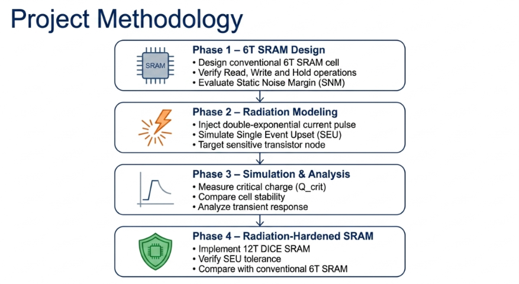
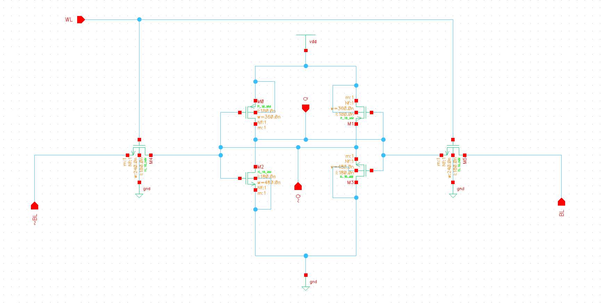
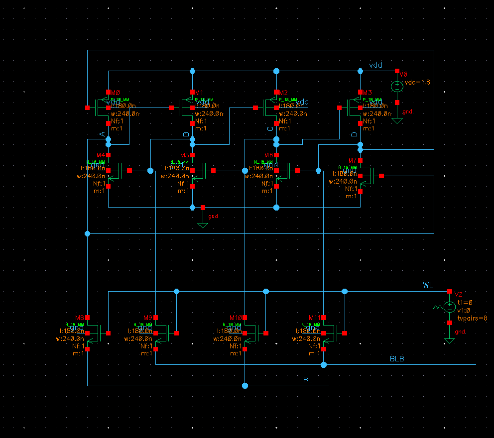

# Radiation Hardened SRAM

> Radiation-hardened SRAM design for mitigating Single Event Upsets (SEUs).
---
## Project Overview
Traditional **6T SRAM** cells are highly susceptible to radiation-induced **Single Event Upsets (SEUs)**, especially in **space**, **satellite**, **automotive**, and **safety-critical** applications.

This project investigates radiation hardening techniques by comparing a conventional 6T SRAM cell with a DICE SRAM architecture. The design was implemented and simulated in Cadence Virtuoso, and transient current injection was used to emulate particle strikes and analyze SEU robustness.

## Project Objectives
This project aims to improve the reliability of SRAM cells against radiation-induced Single Event Upsets (SEUs). The key objectives are:
- Design a conventional **6T SRAM** cell.
- Analyze **Read, Write, and Hold** operations.
- Evaluate the **Static Noise Margin (SNM)** using the butterfly curve.
- Simulate **radiation-induced Single Event Upsets (SEUs)** using transient current injection.
- Calculate the **Critical Charge (Qcrit)** required to cause a bit flip.
- Design and analyze a **DICE (Dual Interlocked Storage Cell) SRAM** architecture.
- Compare the reliability and SEU tolerance of **6T SRAM** and **DICE SRAM** designs.

  
 ## Applications
This project is applicable in systems where memory reliability under radiation exposure is critical.
- Space Electronics
- Satellites
- Aerospace Systems
- Nuclear Electronics
- Automotive Safety Systems
- Military and Defense Electronics

## Design Architecture

The overall workflow of the project begins with the design of a conventional 6T SRAM cell, followed by the implementation of radiation-hardening techniques. Both the conventional and DICE SRAM cells are analyzed under transient current injection to evaluate their resistance against Single Event Upsets (SEUs).

*Figure 1. Overall project workflow.*

## Tools & Technologies

| Tool | Purpose |
|------|---------|
| Cadence Virtuoso | Schematic Design |
| Spectre Simulator | Circuit Simulation |
| CMOS Technology | SRAM Cell Design |
| ADE | Waveform Analysis |

## Conventional 6T SRAM Cell

The conventional 6T SRAM cell consists of two cross-coupled CMOS inverters and two access transistors. It provides high-speed read and write operations but is susceptible to radiation-induced Single Event Upsets (SEUs) in harsh environments.

*Figure 2. Schematic of the conventional 6T SRAM cell.*

## DICE SRAM Architecture

The DICE (Dual Interlocked Storage Cell) architecture improves SRAM reliability by introducing four interlocked storage nodes. This redundancy enables the memory cell to recover from transient radiation-induced disturbances without data corruption.

*Figure 3. DICE SRAM cell architecture.*

